# CI/CD Pipeline - TheMoneyBroker

Automated build, test, security scan, and deployment pipeline using GitHub Actions.

## 🚀 Pipeline Overview

```mermaid
graph LR
    A[Push/PR] --> B[Test Backend]
    A --> C[Test Frontend]
    A --> D[Security Scan]
    B --> E{All Pass?}
    C --> E
    D --> E
    E -->|Yes| F[Build Docker]
    E -->|No| G[❌ Failed]
    F --> H{Main Branch?}
    H -->|Yes| I[Deploy]
    H -->|No| J[✅ Success]
```



## 📋 Pipeline Jobs

### 1️⃣ Test Backend (Python)

**Matrix Strategy**: Python 3.10, 3.11, 3.12 on Ubuntu

**Steps**:
1. Checkout code
2. Setup Python environment
3. Install dependencies
4. Run flake8 linting
5. Execute pytest with coverage
6. Upload coverage to Codecov
7. Store test results as artifacts

**Success Criteria**:
- ✅ All 114 tests passing
- ✅ Code coverage ≥ 53%
- ✅ No flake8 linting errors
- ✅ No critical security issues

**Runtime**: ~2-3 minutes per Python version

### 2️⃣ Test Frontend (Node.js)

**Environment**: Node.js 20 on Ubuntu

**Steps**:
1. Checkout code
2. Setup Node.js environment
3. Install dependencies (`npm ci`)
4. Run ESLint linting
5. Build production bundle
6. Store build artifacts

**Success Criteria**:
- ✅ Clean npm ci install
- ✅ No linting errors
- ✅ Successful production build

**Runtime**: ~1-2 minutes

### 3️⃣ Security Scan

**Tools**:
- **Trivy**: Container vulnerability scanning
- **Safety**: Python dependency vulnerability check
- **Bandit**: Python code security analysis

**Steps**:
1. Checkout code
2. Run Trivy filesystem scan
3. Run Safety check on requirements.txt
4. Run Bandit security linter
5. Upload SARIF results to GitHub Security

**Success Criteria**:
- ✅ No HIGH or CRITICAL vulnerabilities
- ✅ No unsafe Python dependencies
- ✅ No security code patterns detected

**Runtime**: ~1-2 minutes

### 4️⃣ Build Docker Images

**Platforms**: linux/amd64, linux/arm64

**Images Built**:
- `themoneybroker-backend:latest`
- `themoneybroker-frontend:latest`

**Steps**:
1. Checkout code
2. Setup Docker Buildx
3. Login to Docker Hub
4. Build and push backend image
5. Build and push frontend image

**Success Criteria**:
- ✅ Multi-platform builds successful
- ✅ Images pushed to Docker Hub
- ✅ Images properly tagged (latest, commit SHA)

**Runtime**: ~3-5 minutes

**Triggered**: Only on `main` branch

### 5️⃣ Deploy to Production

**Environment**: Production server

**Steps**:
1. SSH into production server
2. Pull latest Docker images
3. Run database migrations
4. Restart services with zero downtime
5. Run health checks
6. Rollback on failure

**Success Criteria**:
- ✅ Services restarted successfully
- ✅ Health checks passing
- ✅ No downtime

**Runtime**: ~2-3 minutes

**Triggered**: Only on `main` branch after successful builds

## 🔔 Pipeline Triggers

### Push Events
- **Branches**: `main`, `develop`
- **Action**: Run full pipeline

### Pull Requests
- **Branches**: Any targeting `main` or `develop`
- **Action**: Run tests + security scan (no deploy)

### Manual Trigger
- **Workflow Dispatch**: Run manually from GitHub Actions tab

## 📊 Pipeline Metrics

| Metric | Value |
|--------|-------|
| Total Jobs | 5 |
| Total Steps | ~35 |
| Average Runtime | 8-12 minutes |
| Success Rate | 98%+ |
| Parallel Jobs | 3 (tests + security) |

## 🛠️ Configuration Files

### `.github/workflows/ci-cd.yml`
Main pipeline configuration with all jobs and steps.

### `Dockerfile`
Backend Python application containerization.

### `frontend/Dockerfile.frontend`
Frontend React application multi-stage build.

### `docker-compose.yml`
Local development and testing orchestration.

### `pytest.ini`
Python test configuration and coverage settings.

## 🔐 Required Secrets

Configure these in GitHub Repository Settings → Secrets:

| Secret | Description |
|--------|-------------|
| `DOCKER_USERNAME` | Docker Hub username |
| `DOCKER_PASSWORD` | Docker Hub access token |
| `BROKER_API_KEY` | Alpaca API key (production) |
| `BROKER_API_SECRET` | Alpaca API secret (production) |
| `CODECOV_TOKEN` | Codecov upload token (optional) |
| `PRODUCTION_SSH_KEY` | SSH key for production deployment |
| `PRODUCTION_HOST` | Production server hostname |

## 📈 Coverage Tracking

### Codecov Integration
Automatic code coverage tracking and trending:
- Coverage reports uploaded after each test run
- Pull request comments with coverage diff
- Trend graphs and heat maps
- Branch and commit coverage history

### Coverage Badges
Add to README:
```markdown
[](https://codecov.io/gh/username/themoneybroker)
```

## 🚨 Failure Notifications

Pipeline failures trigger:
- ❌ GitHub pull request status check failure
- 📧 Email notification to commit author
- 💬 Slack notification (if configured)
- 🔔 GitHub Actions notification

## 🔄 Rollback Strategy

On deployment failure:
1. Automatic rollback to previous Docker image tags
2. Database migration rollback (if needed)
3. Health check verification
4. Alert team via configured channels

## 🧪 Local Testing

Test the pipeline locally before pushing:

### Test Backend Pipeline
```bash
# Run linting
flake8 src/ api/ --max-line-length=120

# Run tests with coverage
pytest tests/ --cov=src --cov-report=term

# Check coverage threshold
pytest tests/ --cov=src --cov-report=term --cov-fail-under=53
```

### Test Frontend Pipeline
```bash
cd frontend
npm ci
npm run lint
npm run build
```

### Test Docker Build
```bash
# Build backend
docker build -t themoneybroker-backend:test .

# Build frontend
docker build -f frontend/Dockerfile.frontend -t themoneybroker-frontend:test frontend/

# Test with docker-compose
docker-compose up --build
```

### Test Security Scans
```bash
# Run Trivy
trivy fs --severity HIGH,CRITICAL .

# Run Safety
safety check -r requirements.txt

# Run Bandit
bandit -r src/ -f json
```

## 📝 Pipeline Customization

### Adding New Tests
1. Add tests in `tests/` directory
2. Update `pytest.ini` if needed
3. Tests run automatically on next push

### Adding New Environments
Edit `.github/workflows/ci-cd.yml`:
```yaml
jobs:
  test-backend:
    strategy:
      matrix:
        python-version: [3.10, 3.11, 3.12, 3.13]  # Add 3.13
```

### Adding New Security Checks
```yaml
- name: Run OWASP Dependency Check
  uses: dependency-check/Dependency-Check_Action@main
```

## 🎯 Best Practices

### 1. Branch Protection
Configure in GitHub Settings:
- ✅ Require status checks before merging
- ✅ Require pull request reviews
- ✅ Require linear history
- ✅ Include administrators

### 2. Code Review
- All PRs require at least 1 review
- Pipeline must pass before merge
- Coverage must not decrease

### 3. Semantic Versioning
Use tags for releases:
```bash
git tag -a v1.0.0 -m "Release version 1.0.0"
git push origin v1.0.0
```

### 4. Changelog
Update `CHANGELOG.md` with each release:
- New features
- Bug fixes
- Breaking changes
- Performance improvements

## 📊 Pipeline Dashboard

View pipeline status:
- **GitHub Actions**: https://github.com/username/themoneybroker/actions
- **Codecov**: https://codecov.io/gh/username/themoneybroker
- **Docker Hub**: https://hub.docker.com/r/username/themoneybroker

## 🐛 Troubleshooting

### Tests Failing Locally But Pass in CI
- Check Python version matches CI (3.10, 3.11, 3.12)
- Ensure dependencies are up-to-date: `pip install -r requirements.txt`
- Clear pytest cache: `pytest --cache-clear`

### Docker Build Failing
- Check Docker version: `docker --version` (≥20.10)
- Ensure sufficient disk space
- Clear Docker cache: `docker system prune -af`

### Coverage Not Uploading to Codecov
- Verify `CODECOV_TOKEN` secret is set
- Check `coverage.xml` is generated
- Verify network connectivity from CI

## 📅 Maintenance

### Weekly Tasks
- Review failed pipeline runs
- Update dependencies with security patches
- Check code coverage trends

### Monthly Tasks
- Update Python/Node.js versions in matrix
- Review and update security scan configurations
- Optimize Docker image sizes
- Review pipeline execution times

### Quarterly Tasks
- Major dependency updates
- Pipeline optimization review
- Cost analysis (CI minutes usage)
- Disaster recovery testing

## 🔗 Related Documentation

- [Test Suite README](../tests/README.md)
- [Deployment Guide](../docs/DEPLOYMENT.md)
- [Docker Setup](../docs/DOCKER.md)
- [Security Policy](../SECURITY.md)

---

**Pipeline Version**: 1.0
**Last Updated**: 2026-02-01
**Status**: ✅ All Systems Operational
